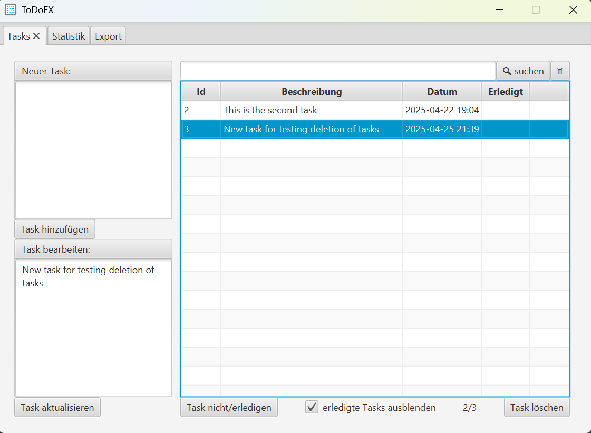
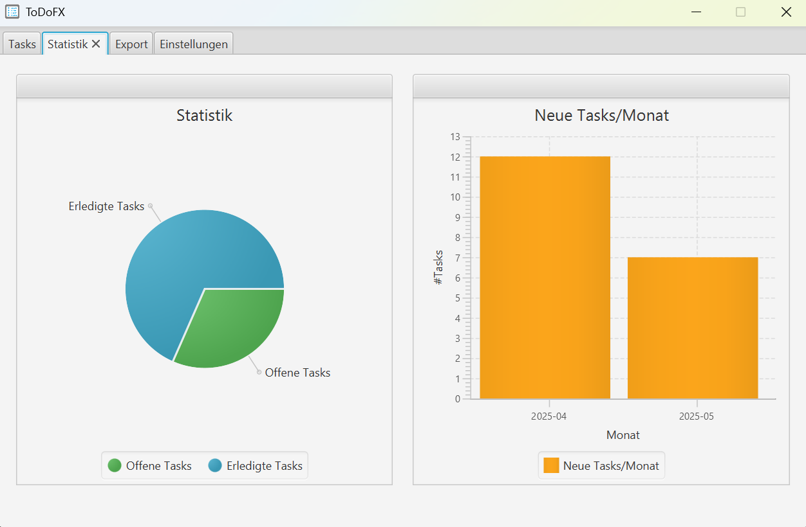
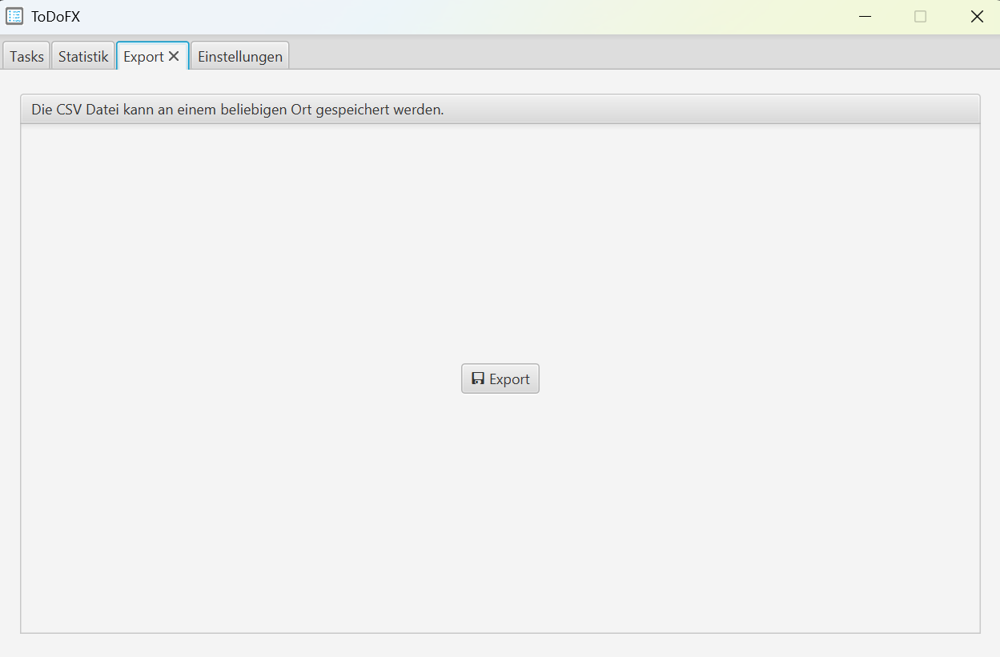

#  ToDoFx


[](https://github.com/ursteiner/ToDoFx/actions/workflows/maven.yml)


ToDoFx is a simple introductory project using Kotlin and JavaFX to manage your tasks!
All tasks are stored in an H2 database in your profile folder using JetBrains Exposed.
```
tasks.mv.db
```

<table>
    <tr>
        <td></td>
        <td></td>
    </tr>
    <tr>
        <td></td>
        <td>&nbsp;</td>
    </tr>
</table>


