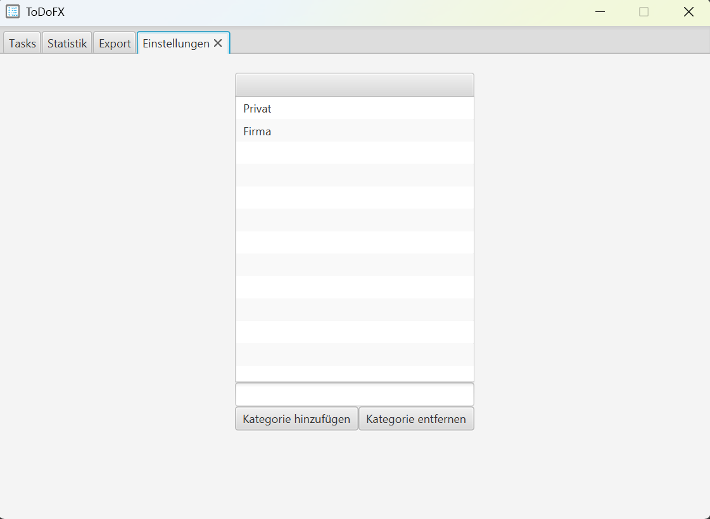

#  ToDoFx


[](https://github.com/ursteiner/ToDoFx/actions/workflows/maven.yml)


ToDoFx is a simple introductory project using Kotlin and JavaFX to manage your tasks!
All tasks are stored in an H2 database in your profile folder using JetBrains Exposed.
```
tasks.mv.db
```

<table>
    <tr>
        <td>
            
            <br><center>Manage your tasks</center>
        </td>
        <td>
            
            <br><center>Take a look at the statistics of your tasks</center>
        </td>
    </tr>
    <tr>
        <td>
            
            <br><center>Export all your tasks as CSV file</center>
        </td>
        <td>
            <br><center>Adjust your preferences on the settings tab</center>
        </td>
    </tr>
</table>

Check for dependency updates
```
.\mvnw versions:display-dependency-updates
```

Check for plugin updates
```
.\mvnw versions:display-plugin-updates
```

