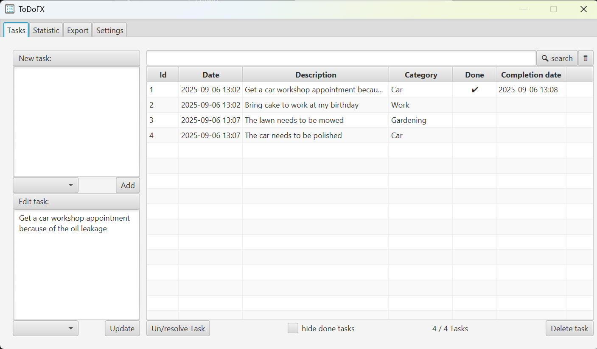
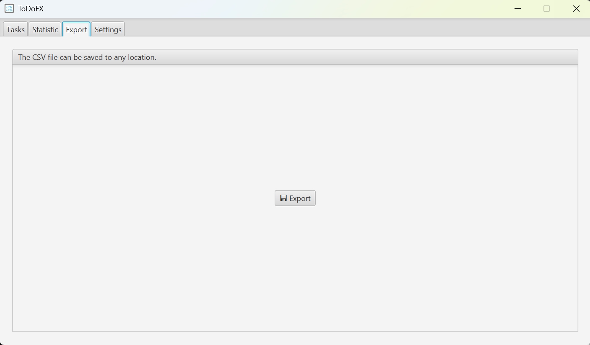
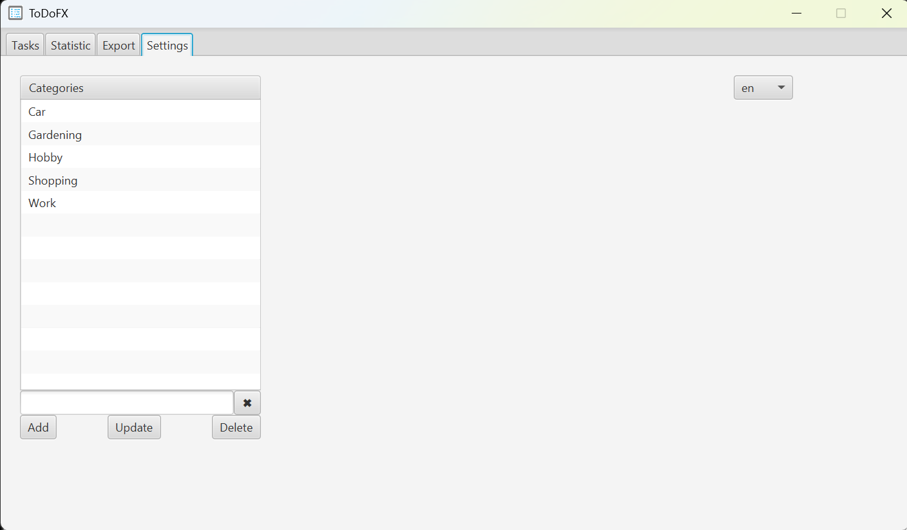

#  ToDoFx


[](https://github.com/ursteiner/ToDoFx/actions/workflows/maven.yml)


ToDoFx is a simple introductory project using Kotlin and JavaFX to manage your tasks!
All tasks are stored in an H2 database in your profile folder using JetBrains Exposed.
```
tasks.mv.db
```

To start the ToDoFx app simply run the main method of <b>ToDoFxApplication</b>.


<table>
    <tr>
        <td>
            
            <br><p align="center">Manage your tasks</p>
        </td>
        <td>
            
            <br><p align="center">Take a look at the statistics of your tasks</p>
        </td>
    </tr>
    <tr>
        <td>
            
            <br><p align="center">Export all your tasks as CSV file</p>
        </td>
        <td>
            <br><p align="center">Adjust your preferences on the settings tab</p>
        </td>
    </tr>
</table>

Check for dependency updates
```
.\mvnw versions:display-dependency-updates
```

Check for plugin updates
```
.\mvnw versions:display-plugin-updates
```

